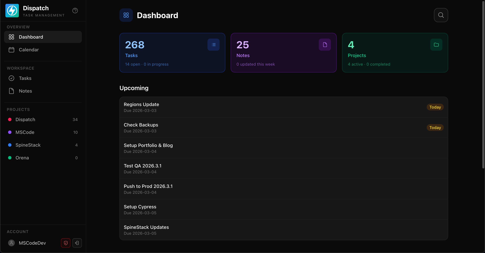

# Dispatch

A personal productivity app for managing tasks, projects, notes, and daily planning.



## Features

- `Dashboard`: instant visibility into active tasks, notes, and project activity.
- `Tasks`: status + priority + due dates + project links.
- `Projects`: progress rollups and scoped task lists.
- `Notes`: markdown editing, preview, and export.

## Project Structure

- `/src/app` - Next.js app router pages and API routes
- `/src/components` - React components
- `/src/db` - Database schema, migrations, and seed data
- `/src/lib` - Shared utilities and API client
- `/drizzle` - Drizzle ORM migration files
- `/public` - Static assets
- `/docker` - Docker entrypoint and helpers

## Getting Started

### Prerequisites

- [Node.js 20+](https://nodejs.org/)
- [Docker Desktop](https://www.docker.com/products/docker-desktop) (optional, for containerised deployment)

### Local Development

1. Initialize the local development environment:
   ```bash
   ./run init
   ```

2. Start the development server:
   ```bash
   ./run start
   ```

Open `http://localhost:3000`.

**Available Commands:**

Run `./run help` to see all available commands.

## Development Tools

### Database

Open the Drizzle Studio GUI to browse and edit data:
```bash
./run studio
```

Reset and re-seed the database:
```bash
./run reset
```

### Testing

```bash
# Run the test suite
./run test

# Run ESLint
./run lint
```

## Configuration

### Local Development

Create `.env.local` before running the app:

> Docker deployment uses `.env.prod` instead of `.env.local`.

```bash
# Required for NextAuth
AUTH_SECRET=your_random_secret
NEXTAUTH_URL=http://localhost:3000

# Optional (defaults to ./dispatch.db)
DATABASE_URL=./dispatch.db
```

A seeded dev account (`test@dispatch.local` / `test`) is created automatically by `./run init`.

## License

MIT License
